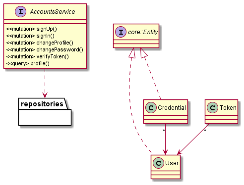

# Accounts Service API

This is a Typescript/Node/Express/MongoDB REST API for Accounts that uses JWT for authentication.

# Getting Started
This service manages account Sign-up, Sign-in and user profile update and change password endpoints.

## Domain Model


## Service REST endpoints
- `POST /signup`: New user sign-up 
- `POST /signin`: Sign-in with credentials
- `GET /profile`: Retrieve logged in user profile
- `PUT /profile`: Update profile
- `PUT /password`: Change password

# Usage

## Install dependencies and/or build
```bash
yarn install
yarn build
```

## Run in dev or build
```bash
yarn dev
yarn start
```

## Environment variables

```bash
DB_URL=<mongo-connection-string>
DB_OPTIONS=<mongo-connection-options>
SECRET=<bcrypt-secret>
SERVER_HOST=(defaults to '0.0.0.0')
PORT=(defaults to 5000)
API_BASE_URI=(defaults to '/')
```

# Running unit tests
Jest based test with coverage details.
```bash
yarn test
```

# Container build
Container is based on standard Dockerfile. Following helpful npm/yarn scripts and provided.
- `docker-build`: Builds docker container
- `docker-run`: Runs/creates a new containers locally for testing purposes.
- `docker-login`: Login for AWS ECR registry using default AWS Profile.
- `docker-push`: Tag and push container to AWS ECR.

# Continuos Integration/Deployment
Based on GitHub Actions, see `.github/workflows/main.yml` for details.

## Credits

- Michael Elliott
